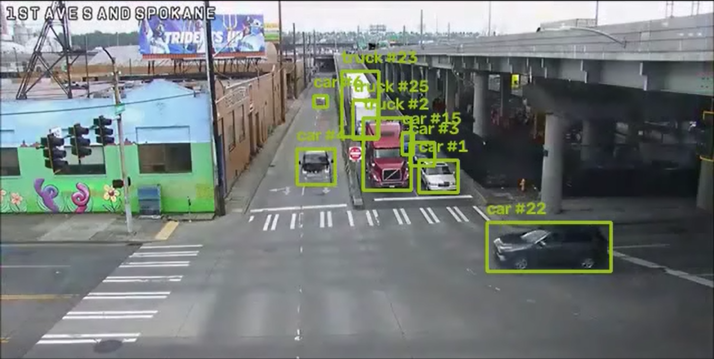
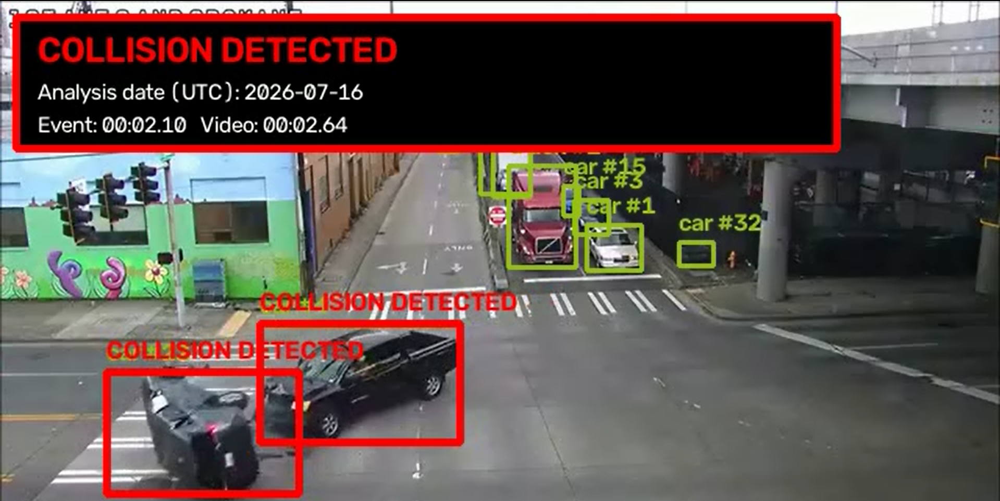

# TrafficVision

TrafficVision is a local traffic-camera computer vision project and how vision system works, not only how to run one YOLO model. I wanted to work with vehicle detection, tracking, license plate reading, speed calculation, traffic rules, evidence, a backend API and a dashboard in one project.

This is not an automatic police or ticketing system. The results are possible detections and a person still needs to review them.

## What I used

- Python, FastAPI and SQLite for the local backend
- React, TypeScript, Vite and Tailwind for the dashboard
- OpenCV and FFmpeg for video processing
- Ultralytics YOLO and ByteTrack for vehicle detection and tracking
- FastALPR and ONNX Runtime for plate detection and OCR
- PyTorch with CUDA when an NVIDIA GPU is available

The faster profiles use YOLO11n. GPU Accuracy uses YOLO11s, analyzes every frame and is the better choice for fast sideways vehicles or collision clips.

SQLite is only a file inside the `data` folder. There is no cloud database, no deployment and no footage upload to an outside service. The frontend and backend only run on `127.0.0.1` by default.

## How it works

You upload a traffic video and choose what you want to analyze. The system detects vehicles and other road users, gives tracked objects an ID and follows them across frames. It can then use the camera setup to check things like counting, congestion, speed, parking, wrong-way movement, lane rules and red lights.

For license plates, it first finds the vehicle and then looks for the real plate inside that vehicle crop. It is not locked to an Ethiopian plate format and it does not replace a bad reading with a made-up number. Plate results still depend on video quality, distance, lighting and motion blur.

## Run it locally

This project is made for Windows 10 or 11.

```powershell
.\setup.ps1
.\start.ps1
```
- Dashboard: <http://127.0.0.1:5173>
- API docs: <http://127.0.0.1:8000/docs>

Stop it with:

```powershell
.\stop.ps1
```

## Footage to use

Start with short MP4 clips, around 20 seconds to 2 minutes, preferably 1080p and from a fixed camera. Useful free places to look are:

- [Pexels traffic videos](https://www.pexels.com/search/videos/traffic/) — check the [Pexels license](https://www.pexels.com/license/)
- [Pixabay traffic videos](https://pixabay.com/videos/search/traffic/) — check the [Pixabay terms](https://pixabay.com/service/terms/)
- [Mixkit traffic videos](https://mixkit.co/free-stock-video/traffic/) — check the [Mixkit license](https://mixkit.co/license/)
- [GRAM Road-Traffic Monitoring dataset](https://gram.web.uah.es/data/datasets/rtm/index.html) for vehicle detection and tracking research
- [US DOT NGSIM data](https://data.transportation.gov/Automobiles/Next-Generation-Simulation-NGSIM-Vehicle-Trajector/8ect-6jqj) for traffic trajectories and supporting data

For speed and license plates, recording your own authorized fixed-camera footage is usually better. You can make sure the plate is actually readable and measure a real road distance. Do not stand in the road or record somewhere you are not allowed to record.

## Screenshots

| 1 | 2 |
| :---: | :---: |
|  |  |


## What footage need to check each part

- Detection and tracking: normal traffic with several cars entering and leaving the frame.
- Counting: a fixed view where vehicles clearly cross one point or line.
- Congestion: a queue that grows and then moves again.
- Plate OCR: a vehicle passing close enough for the plate to be sharp and readable.
- Speed: a fixed camera, a measured distance in meters and preferably a known reference speed.
- Parking: one vehicle staying still inside the same marked area.
- Wrong-way or U-turn: a clip where the correct road direction is obvious.
- Red light: the traffic light and stop line must both be visible in the same fixed video.
- Lane rules: visible lane markings and a vehicle crossing or using the wrong lane.
- Collision or hazards: only licensed, staged or safely recorded footage. Fire, flood, potholes and debris need a specialized model before they can be trusted.

## How to manually check it

1. Start the app and upload one short video in Video Analysis.
2. First run only vehicle counting and tracking.
3. Watch the annotated output and compare the IDs and count with what you see yourself.
4. Enable plate OCR only for a clip where the plate is actually readable. Compare the saved text with the visible plate.
5. Open Camera Studio and draw the lanes, zones, stop line and direction for that exact camera.
6. For speed, enter the measured distance and route speed limit. Compare the result with known ground truth, not a guess.
7. Test one rule at a time before enabling everything together.
8. Record false positives, missed vehicles and wrong plate characters. A feature passes only when it works consistently on several different clips, not just one good example.
